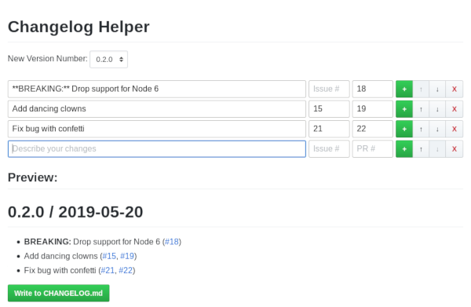

# changelog-helper

I don't know about you, but I hate writing changelogs. At the same time, a well-written changelog is incredibly useful for users of your package; not keeping a changelog (or dumping git commit histories into a file and calling it a changelog) isn't a good option.

Some people use automated tools like [conventional-changelog](https://github.com/conventional-changelog/conventional-changelog), but those require you to keep a special git commit message format for every commit, and frankly, I hate doing that just as much.

So, I've built a little `changelog-helper`; a browser interface for writing your changelogs in.

## Screenshot



## Installation

```sh
npm install -g changelog-helper
```

## Usage

From your project directory, run `changelog-helper`. It will open your browser to the interface where you can write your changelog and preview it. When you're done, click `Write to CHANGELOG.md`, and your new release notes will be prepended onto your `CHANGELOG.md` (or the file will be created if it doesn't exist).

## License

ISC
